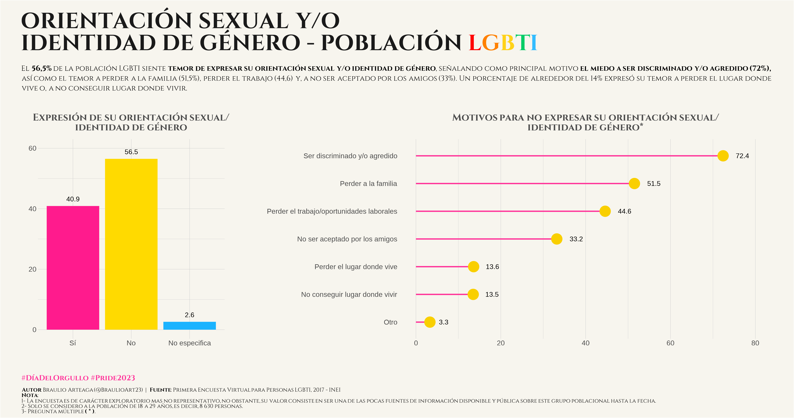
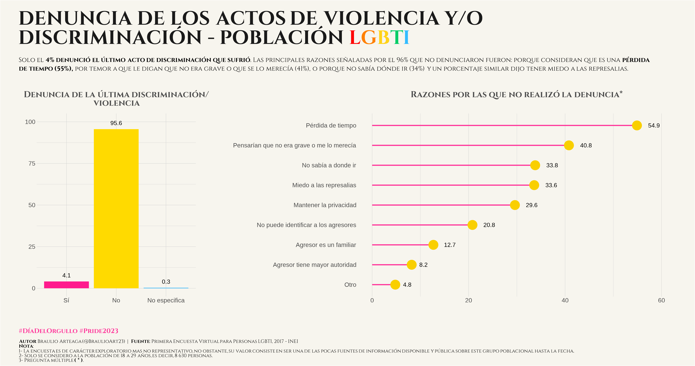

# Topic: LGBTI Population 🌈

Con miras al mes del #Orgullo2023, elabore gráficos que visibilizan la problemática social de esta población en el Perú. Utilice la [Primera Encuesta Virtual para Personas LGBTI - 2017](https://www.inei.gob.pe/media/MenuRecursivo/boletines/lgbti.pdf) que es una encuesta exploratoria pero no representativa, sin embargo, su valor radica en que es una de las pocas fuentes de información pública disponible sobre este grupo poblacional a la fecha.

  

### [Code](https://github.com/braulio-arteaga/Graphics-Miscellany/blob/main/01_LGBTI/02_codes/LGBTI_graphics.Rmd) | 🏳️‍🌈 Gráfico 1. Orientación sexual y/o identidad de género - [INEI](https://proyectos.inei.gob.pe/microdatos/)

### [Code](https://github.com/braulio-arteaga/Graphics-Miscellany/blob/main/01_LGBTI/02_codes/LGBTI_graphics.Rmd) | 🏳️‍🌈 Gráfico 2. Discriminación y/o violencia - [INEI](https://proyectos.inei.gob.pe/microdatos/)

### [Code](https://github.com/braulio-arteaga/Graphics-Miscellany/blob/main/01_LGBTI/02_codes/LGBTI_graphics.Rmd) | 🏳️‍🌈 Gráficos 3. Denuncias de actos de discriminación o violencia - [INEI](https://proyectos.inei.gob.pe/microdatos/)

#### 📬 Escríbeme a mi correo **marden.arteaga@unmsm.edu.pe** para cualquier duda/problema/sugerencia con este repositorio.  
